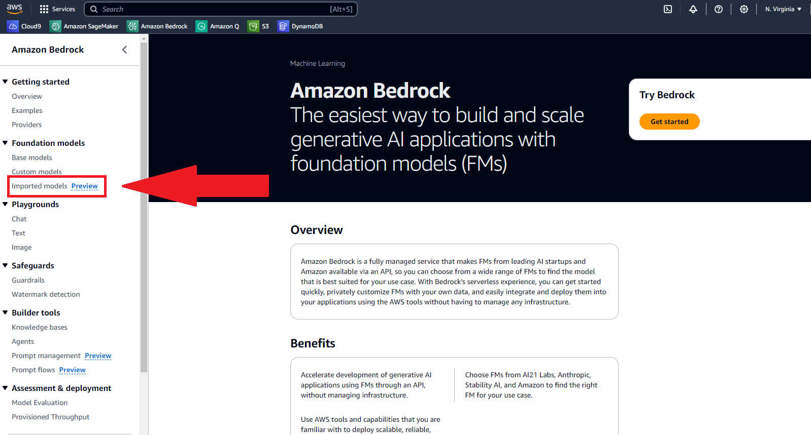
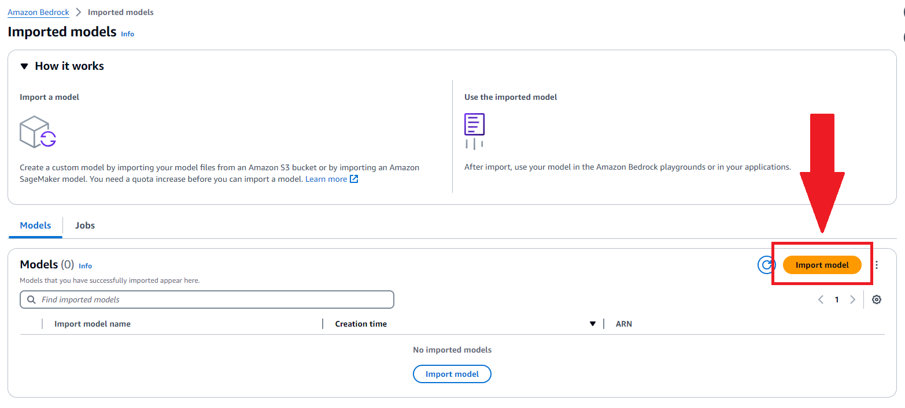
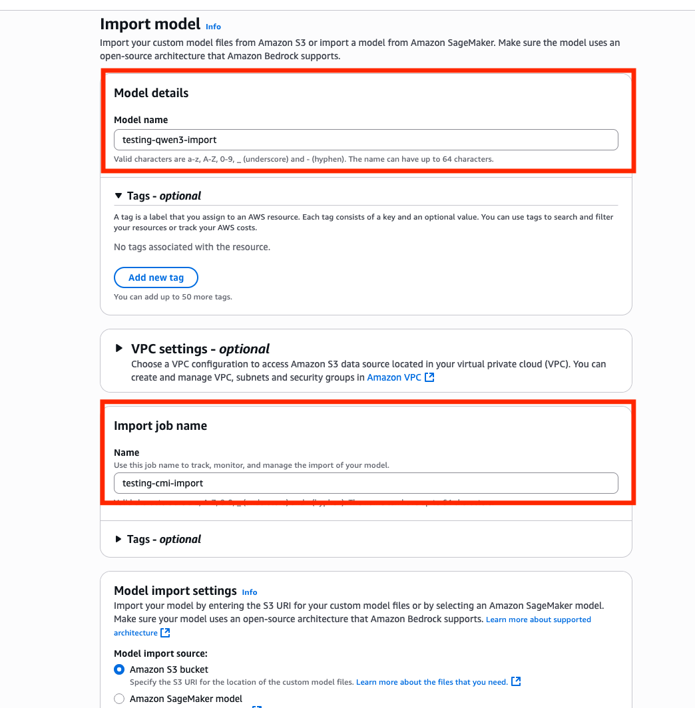
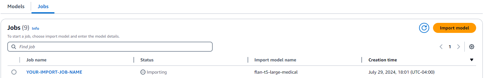
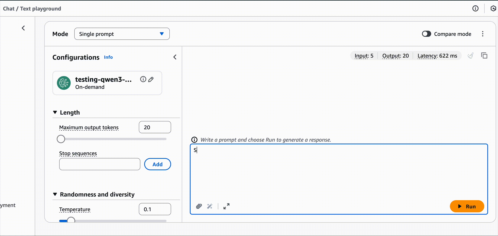
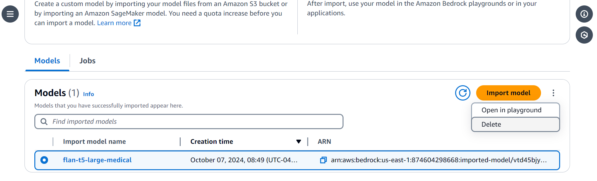

# Amazon Bedrock Custom Model Import (CMI)

Bedrock Custom Model Import allows for importing foundation models that have been customized in other environments outside of Amazon Bedrock, such as Amazon Sagemaker, EC2, etc.

## Importing Model to Amazon Bedrock

To import a model, model artifacts need to be uploaded in a S3 bucket. Before you upload your model weights into the bucket make sure that:
1. Uploaded weights are supported in the Amazon Bedrock Custom Model Import (CMI).

[This](https://docs.aws.amazon.com/bedrock/latest/userguide/model-customization-import-model.html) page lists updated documentation on the matter.

Once model artifacts are uploaded into an S3 bucket, we can import it into Amazon Bedrock.

In the AWS console, we can go to the Amazon Bedrock page. On the left side under "Foundation models" we will click on "Imported models"

You can now click on "Import model"

In this next step you will have to configure:

1. Model Name 
2. Import Job Name 
3. Model Import Settings 
    a. Select Amazon S3 bucket 
    b. Select your bucket location
4. You can optionally:
    a. Customize encryption. You can use your encryption key so that the models are encrypted at rest with your encryption key. 
    b. Create a service role that grants Bedrock permissions to access AWS services on your behalf. 
    c. Use a VPC Setting, so that your model is only accessible within your VPC configuration.
    d. Add to the job and the model.
5. Click Import Model (not shown in image)

You will now be taken to the page below. Your model may take up to an hour to import. 

After your model imports you will then be able to test it via the playground or API! 

## Clean Up 

You can delete your Imported Model in the console as shown in the image below:

